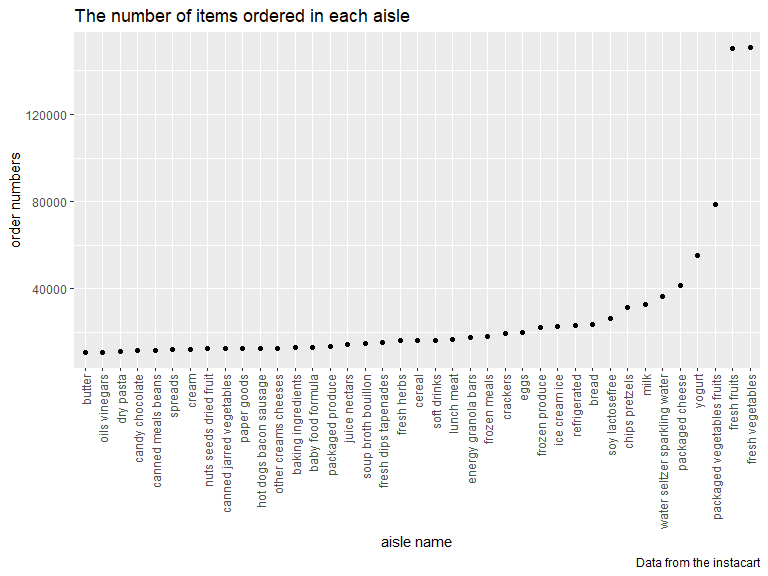

p8105\_hw3\_jl6048
================
Jinghan Liu

``` r
library(tidyverse)
library(p8105.datasets)
library(patchwork)
```

## Problem 1

**How many aisles are there, and which aisles are the most items ordered
from?**

-   There are 134 aisles in this data set and the most items are ordered
    from the fresh vegetables and fresh fruits aisles.

``` r
data("instacart")
instacart_df =
  instacart %>%
  janitor::clean_names()%>%
  count(aisle) %>%
  arrange(desc(n))
instacart_df
```

    ## # A tibble: 134 x 2
    ##    aisle                              n
    ##    <chr>                          <int>
    ##  1 fresh vegetables              150609
    ##  2 fresh fruits                  150473
    ##  3 packaged vegetables fruits     78493
    ##  4 yogurt                         55240
    ##  5 packaged cheese                41699
    ##  6 water seltzer sparkling water  36617
    ##  7 milk                           32644
    ##  8 chips pretzels                 31269
    ##  9 soy lactosefree                26240
    ## 10 bread                          23635
    ## # ... with 124 more rows

**Make a plot that shows the number of items ordered in each aisle,
limiting this to aisles with more than 10000 items ordered**

``` r
instacart_df %>%
  filter(n > 10000) %>%
  mutate(
    aisle = factor(aisle),
    aisle = fct_reorder(aisle, n)) %>%
   ggplot(aes(x = aisle, y = n)) + 
  geom_point() + 
  labs(
    title = "The number of items ordered in each aisle",
    x = "aisle name",
    y = "order numbers",
    caption = "Data from the instacart") + 
  theme(axis.text.x = element_text(angle = 90, vjust = 0.5, hjust = 1))
```

<!-- -->

**Make a table showing the three most popular items**

``` r
popitems_df = 
  instacart %>%
  filter(aisle %in% c("baking ingredients", "dog food care", "packaged vegetables fruits")) %>% 
    group_by(aisle) %>% 
    count(product_name) %>% 
    mutate(rank = min_rank(desc(n))) %>%
    filter(rank < 4) %>% 
    arrange(aisle, rank) %>% 
    knitr::kable()
popitems_df
```

| aisle                      | product\_name                                 |    n | rank |
|:---------------------------|:----------------------------------------------|-----:|-----:|
| baking ingredients         | Light Brown Sugar                             |  499 |    1 |
| baking ingredients         | Pure Baking Soda                              |  387 |    2 |
| baking ingredients         | Cane Sugar                                    |  336 |    3 |
| dog food care              | Snack Sticks Chicken & Rice Recipe Dog Treats |   30 |    1 |
| dog food care              | Organix Chicken & Brown Rice Recipe           |   28 |    2 |
| dog food care              | Small Dog Biscuits                            |   26 |    3 |
| packaged vegetables fruits | Organic Baby Spinach                          | 9784 |    1 |
| packaged vegetables fruits | Organic Raspberries                           | 5546 |    2 |
| packaged vegetables fruits | Organic Blueberries                           | 4966 |    3 |

**Make a table showing the mean hour of the day at which Pink Lady
Apples and Coffee Ice Cream are ordered on each day of the week;**

``` r
meanhour_df =
  instacart %>%
  filter(product_name %in% c("Pink Lady Apples","Coffee Ice Cream")) %>%
  group_by(product_name, order_dow) %>%
  summarize(mean_hour = mean(order_hour_of_day)) %>%
  pivot_wider(
    names_from = order_dow,
    values_from = mean_hour) %>% 
  rename(
    sun. = "0", mon. = "1", tue. = "2", 
    wed. = "3", thu. = "4", fri. = "5", sat. = "6") %>% 
  knitr::kable()
 meanhour_df 
```

| product\_name    |     sun. |     mon. |     tue. |     wed. |     thu. |     fri. |     sat. |
|:-----------------|---------:|---------:|---------:|---------:|---------:|---------:|---------:|
| Coffee Ice Cream | 13.77419 | 14.31579 | 15.38095 | 15.31818 | 15.21739 | 12.26316 | 13.83333 |
| Pink Lady Apples | 13.44118 | 11.36000 | 11.70213 | 14.25000 | 11.55172 | 12.78431 | 11.93750 |

**Description**: This datasets has 1384617 observations and 15
variables.

The key variables are as follows: \* `product_name`: name of the product
\* `aisle`: name of the aisle \* `order_dow`: the day of the week on
which the order was placed \* `order_hour_of_day`: the hour of the day
on which the order was placed \* `order_id`: order identifier \*
`product_id`: product identifier

For example, the individual with user id 66177 ordered 21 and they are
most from the snacks department.

## Problem 2

**data cleaning**

``` r
data("brfss_smart2010")
brfss_smart=
  brfss_smart2010 %>%
  janitor::clean_names() %>%
  filter(topic == "Overall Health") %>%
  mutate(
    response = forcats::fct_relevel(response, c("Excellent", "Very good", "Good", "Fair", "Poor"))) %>%
  arrange(desc(response))
brfss_smart
```

    ## # A tibble: 10,625 x 23
    ##     year locationabbr locationdesc  class  topic  question  response sample_size
    ##    <int> <chr>        <chr>         <chr>  <chr>  <chr>     <fct>          <int>
    ##  1  2010 AL           AL - Jeffers~ Healt~ Overa~ How is y~ Poor              45
    ##  2  2010 AL           AL - Mobile ~ Healt~ Overa~ How is y~ Poor              66
    ##  3  2010 AL           AL - Tuscalo~ Healt~ Overa~ How is y~ Poor              35
    ##  4  2010 AZ           AZ - Maricop~ Healt~ Overa~ How is y~ Poor              62
    ##  5  2010 AZ           AZ - Pima Co~ Healt~ Overa~ How is y~ Poor              49
    ##  6  2010 AZ           AZ - Pinal C~ Healt~ Overa~ How is y~ Poor              30
    ##  7  2010 AR           AR - Benton ~ Healt~ Overa~ How is y~ Poor              21
    ##  8  2010 AR           AR - Pulaski~ Healt~ Overa~ How is y~ Poor              36
    ##  9  2010 AR           AR - Washing~ Healt~ Overa~ How is y~ Poor              16
    ## 10  2010 CA           CA - Alameda~ Healt~ Overa~ How is y~ Poor              23
    ## # ... with 10,615 more rows, and 15 more variables: data_value <dbl>,
    ## #   confidence_limit_low <dbl>, confidence_limit_high <dbl>,
    ## #   display_order <int>, data_value_unit <chr>, data_value_type <chr>,
    ## #   data_value_footnote_symbol <chr>, data_value_footnote <chr>,
    ## #   data_source <chr>, class_id <chr>, topic_id <chr>, location_id <chr>,
    ## #   question_id <chr>, respid <chr>, geo_location <chr>

**In 2002, which states were observed at 7 or more locations? What about
in 2010?**

``` r
states_2002_df =
  brfss_smart2010 %>%
  janitor::clean_names() %>%
  filter(year == 2002) %>%
  group_by(locationabbr) %>%
  summarize(
    country_num = n_distinct(locationdesc)) %>% 
  filter(country_num >= 7)
states_2002_df
```

    ## # A tibble: 6 x 2
    ##   locationabbr country_num
    ##   <chr>              <int>
    ## 1 CT                     7
    ## 2 FL                     7
    ## 3 MA                     8
    ## 4 NC                     7
    ## 5 NJ                     8
    ## 6 PA                    10

``` r
states_2010_df =
  brfss_smart2010 %>%
  janitor::clean_names() %>%
  filter(year == 2010) %>%
  group_by(locationabbr) %>%
  summarize(
    country_num = n_distinct(locationdesc)) %>% 
  filter(country_num >= 7)
states_2010_df
```

    ## # A tibble: 14 x 2
    ##    locationabbr country_num
    ##    <chr>              <int>
    ##  1 CA                    12
    ##  2 CO                     7
    ##  3 FL                    41
    ##  4 MA                     9
    ##  5 MD                    12
    ##  6 NC                    12
    ##  7 NE                    10
    ##  8 NJ                    19
    ##  9 NY                     9
    ## 10 OH                     8
    ## 11 PA                     7
    ## 12 SC                     7
    ## 13 TX                    16
    ## 14 WA                    10

\*solution: In 2002, CT, FL, MA, NC, NJ, PA were observed at 7 or more
locations. In 2010, CA, CO, FL, MA, MD, NC, NE, NJ, NY, OH, PA, SC, TX,
WA were observed at 7 or more locations.
