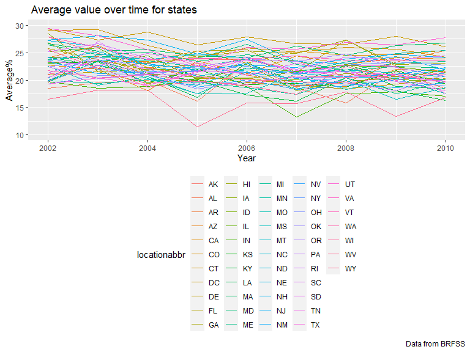

p8105\_hw3\_jl6048
================
Jinghan Liu

``` r
library(tidyverse)
library(p8105.datasets)
library(ggridges)
library(patchwork)
library(readxl)

knitr::opts_chunk$set(
  echo = TRUE,
  warning = FALSE,
  fig.width = 8,
  fig.height = 6,
  out.width = "90%"
  )
```

## Problem 1

**How many aisles are there, and which aisles are the most items ordered
from?**

-   There are 134 aisles in this data set and the most items are ordered
    from the fresh vegetables and fresh fruits aisles.

``` r
data("instacart")
instacart_df =
  instacart %>%
  janitor::clean_names()%>%
  count(aisle) %>%
  arrange(desc(n))
instacart_df
```

    ## # A tibble: 134 x 2
    ##    aisle                              n
    ##    <chr>                          <int>
    ##  1 fresh vegetables              150609
    ##  2 fresh fruits                  150473
    ##  3 packaged vegetables fruits     78493
    ##  4 yogurt                         55240
    ##  5 packaged cheese                41699
    ##  6 water seltzer sparkling water  36617
    ##  7 milk                           32644
    ##  8 chips pretzels                 31269
    ##  9 soy lactosefree                26240
    ## 10 bread                          23635
    ## # ... with 124 more rows

**Make a plot that shows the number of items ordered in each aisle,
limiting this to aisles with more than 10000 items ordered**

``` r
instacart_df %>%
  filter(n > 10000) %>%
  mutate(
    aisle = factor(aisle),
    aisle = fct_reorder(aisle, n)) %>%
   ggplot(aes(x = aisle, y = n)) + 
  geom_point() + 
  labs(
    title = "The number of items ordered in each aisle",
    x = "aisle name",
    y = "order numbers",
    caption = "Data from the instacart") + 
  theme(axis.text.x = element_text(angle = 90, vjust = 0.5, hjust = 1))
```


**Make a table showing the three most popular items**

``` r
popitems_df = 
  instacart %>%
  filter(aisle %in% c("baking ingredients", "dog food care", "packaged vegetables fruits")) %>% 
    group_by(aisle) %>% 
    count(product_name) %>% 
    mutate(rank = min_rank(desc(n))) %>%
    filter(rank < 4) %>% 
    arrange(aisle, rank) %>% 
    knitr::kable()
popitems_df
```

| aisle                      | product\_name                                 |    n | rank |
|:---------------------------|:----------------------------------------------|-----:|-----:|
| baking ingredients         | Light Brown Sugar                             |  499 |    1 |
| baking ingredients         | Pure Baking Soda                              |  387 |    2 |
| baking ingredients         | Cane Sugar                                    |  336 |    3 |
| dog food care              | Snack Sticks Chicken & Rice Recipe Dog Treats |   30 |    1 |
| dog food care              | Organix Chicken & Brown Rice Recipe           |   28 |    2 |
| dog food care              | Small Dog Biscuits                            |   26 |    3 |
| packaged vegetables fruits | Organic Baby Spinach                          | 9784 |    1 |
| packaged vegetables fruits | Organic Raspberries                           | 5546 |    2 |
| packaged vegetables fruits | Organic Blueberries                           | 4966 |    3 |

**Make a table showing the mean hour of the day at which Pink Lady
Apples and Coffee Ice Cream are ordered on each day of the week;**

``` r
meanhour_df =
  instacart %>%
  filter(product_name %in% c("Pink Lady Apples","Coffee Ice Cream")) %>%
  group_by(product_name, order_dow) %>%
  summarize(mean_hour = mean(order_hour_of_day)) %>%
  pivot_wider(
    names_from = order_dow,
    values_from = mean_hour) %>% 
  rename(
    sun. = "0", mon. = "1", tue. = "2", 
    wed. = "3", thu. = "4", fri. = "5", sat. = "6") %>% 
  knitr::kable()
```

    ## `summarise()` has grouped output by 'product_name'. You can override using the `.groups` argument.

``` r
 meanhour_df 
```

| product\_name    |     sun. |     mon. |     tue. |     wed. |     thu. |     fri. |     sat. |
|:-----------------|---------:|---------:|---------:|---------:|---------:|---------:|---------:|
| Coffee Ice Cream | 13.77419 | 14.31579 | 15.38095 | 15.31818 | 15.21739 | 12.26316 | 13.83333 |
| Pink Lady Apples | 13.44118 | 11.36000 | 11.70213 | 14.25000 | 11.55172 | 12.78431 | 11.93750 |

**Description**: This datasets has 1384617 observations and 15
variables.

The key variables are as follows: \* `product_name`: name of the product
\* `aisle`: name of the aisle \* `order_dow`: the day of the week on
which the order was placed \* `order_hour_of_day`: the hour of the day
on which the order was placed \* `order_id`: order identifier \*
`product_id`: product identifier

For example, the individual with user id 66177 ordered 21 and they are
most from the snacks department.

## Problem 2

**data cleaning**

``` r
data("brfss_smart2010")
brfss_smart=
  brfss_smart2010 %>%
  janitor::clean_names() %>%
  filter(topic == "Overall Health") %>%
  mutate(
    response = forcats::fct_relevel(response, c("Excellent", "Very good", "Good", "Fair", "Poor"))) %>%
  arrange(desc(response))
brfss_smart
```

    ## # A tibble: 10,625 x 23
    ##     year locationabbr locationdesc  class  topic  question  response sample_size
    ##    <int> <chr>        <chr>         <chr>  <chr>  <chr>     <fct>          <int>
    ##  1  2010 AL           AL - Jeffers~ Healt~ Overa~ How is y~ Poor              45
    ##  2  2010 AL           AL - Mobile ~ Healt~ Overa~ How is y~ Poor              66
    ##  3  2010 AL           AL - Tuscalo~ Healt~ Overa~ How is y~ Poor              35
    ##  4  2010 AZ           AZ - Maricop~ Healt~ Overa~ How is y~ Poor              62
    ##  5  2010 AZ           AZ - Pima Co~ Healt~ Overa~ How is y~ Poor              49
    ##  6  2010 AZ           AZ - Pinal C~ Healt~ Overa~ How is y~ Poor              30
    ##  7  2010 AR           AR - Benton ~ Healt~ Overa~ How is y~ Poor              21
    ##  8  2010 AR           AR - Pulaski~ Healt~ Overa~ How is y~ Poor              36
    ##  9  2010 AR           AR - Washing~ Healt~ Overa~ How is y~ Poor              16
    ## 10  2010 CA           CA - Alameda~ Healt~ Overa~ How is y~ Poor              23
    ## # ... with 10,615 more rows, and 15 more variables: data_value <dbl>,
    ## #   confidence_limit_low <dbl>, confidence_limit_high <dbl>,
    ## #   display_order <int>, data_value_unit <chr>, data_value_type <chr>,
    ## #   data_value_footnote_symbol <chr>, data_value_footnote <chr>,
    ## #   data_source <chr>, class_id <chr>, topic_id <chr>, location_id <chr>,
    ## #   question_id <chr>, respid <chr>, geo_location <chr>

**In 2002, which states were observed at 7 or more locations? What about
in 2010?**

``` r
states_2002_df =
  brfss_smart2010 %>%
  janitor::clean_names() %>%
  filter(year == 2002) %>%
  group_by(locationabbr) %>%
  summarize(
    country_num = n_distinct(locationdesc)) %>% 
  filter(country_num >= 7)
states_2002_df
```

    ## # A tibble: 6 x 2
    ##   locationabbr country_num
    ##   <chr>              <int>
    ## 1 CT                     7
    ## 2 FL                     7
    ## 3 MA                     8
    ## 4 NC                     7
    ## 5 NJ                     8
    ## 6 PA                    10

``` r
states_2010_df =
  brfss_smart2010 %>%
  janitor::clean_names() %>%
  filter(year == 2010) %>%
  group_by(locationabbr) %>%
  summarize(
    country_num = n_distinct(locationdesc)) %>% 
  filter(country_num >= 7)
states_2010_df
```

    ## # A tibble: 14 x 2
    ##    locationabbr country_num
    ##    <chr>              <int>
    ##  1 CA                    12
    ##  2 CO                     7
    ##  3 FL                    41
    ##  4 MA                     9
    ##  5 MD                    12
    ##  6 NC                    12
    ##  7 NE                    10
    ##  8 NJ                    19
    ##  9 NY                     9
    ## 10 OH                     8
    ## 11 PA                     7
    ## 12 SC                     7
    ## 13 TX                    16
    ## 14 WA                    10

\*Solution: In 2002, CT, FL, MA, NC, NJ, PA were observed at 7 or more
locations. In 2010, CA, CO, FL, MA, MD, NC, NE, NJ, NY, OH, PA, SC, TX,
WA were observed at 7 or more locations.

**Construct a dataset that is limited to Excellent responses. Make a
“spaghetti” plot of this average value over time within a state .**

``` r
excellent_resp =
  brfss_smart2010 %>%
  janitor::clean_names() %>%
  filter(response == "Excellent") %>%
  group_by(locationabbr,year) %>%
  summarize(
    ave_value = mean(data_value)) %>% 
  select(year, locationabbr, ave_value)  %>% 
  
   ggplot(aes(x = year, y = ave_value,  color = locationabbr)) +
  geom_line(aes(group = locationabbr)) +
  labs(
    title = " Average value over time for states ",
    x = "Year",
    y = "Average%",
    caption = "Data from BRFSS")
```

    ## `summarise()` has grouped output by 'locationabbr'. You can override using the `.groups` argument.

``` r
excellent_resp
```


\*Solution: Above is the spaghetti plot of average value over time
within the 51 states. Because there are many states, it cannot easy to
distinguish each one. However, we can still observe the extreme decrease
in 2005.

**Make a two-panel plot for the years 2006, and 2010**

``` r
two_panel =
  brfss_smart2010 %>%
  janitor::clean_names() %>%
  filter(year == "2006" | year == "2010")%>%
  filter(locationabbr == "NY") %>%
  mutate(data_value = as.numeric(data_value), 
         year = as.factor(year), 
         locationdesc = as.factor(locationdesc),
         response = as.factor(response)) %>%
  filter(response %in% c("Poor", "Fair", "Good", "Very good", "Excellent")) %>% 
  mutate(
    response = factor(response, levels = c("Poor", "Fair", "Good", "Very good", "Excellent")))%>% 
  select(year, data_value, locationdesc, response) %>%
  
  ggplot(aes(x = response, y = data_value)) +
  geom_bar(stat = "identity", fill="steelblue", position=position_dodge()) + facet_grid(. ~year) +
  labs(
    title = "Distribution of data_value for responses",
    x = "Response Level",
    y = "data_value") + 
  theme(axis.text.x = element_text(angle = 90, vjust = 0.5, hjust = 1)) 

two_panel
```


\*Solution The distribution of response in NY state between 2006 and
2010 are quite similar.

## Problem 3

**Load, tidy, and otherwise wrangle the data **

``` r
accel_data = 
  read_csv("./data/accel_data.csv") %>%
  janitor::clean_names() %>%
pivot_longer(
    cols = activity_1:activity_1440,
    names_to = "minute",
    values_to = "activity_amount",
    names_prefix = "activity_") %>%
mutate(day_type = ifelse(day == "Saturday" | day == "Sunday", "Weekend", "Weekday"))  %>%
  mutate(day = forcats::fct_relevel(day, c("Monday", "Tuesday", "Wednesday", "Thursday", "Friday", "Saturday", "Sunday")))
```

    ## Rows: 35 Columns: 1443

    ## -- Column specification --------------------------------------------------------
    ## Delimiter: ","
    ## chr    (1): day
    ## dbl (1442): week, day_id, activity.1, activity.2, activity.3, activity.4, ac...

    ## 
    ## i Use `spec()` to retrieve the full column specification for this data.
    ## i Specify the column types or set `show_col_types = FALSE` to quiet this message.

``` r
accel_data
```

    ## # A tibble: 50,400 x 6
    ##     week day_id day    minute activity_amount day_type
    ##    <dbl>  <dbl> <fct>  <chr>            <dbl> <chr>   
    ##  1     1      1 Friday 1                 88.4 Weekday 
    ##  2     1      1 Friday 2                 82.2 Weekday 
    ##  3     1      1 Friday 3                 64.4 Weekday 
    ##  4     1      1 Friday 4                 70.0 Weekday 
    ##  5     1      1 Friday 5                 75.0 Weekday 
    ##  6     1      1 Friday 6                 66.3 Weekday 
    ##  7     1      1 Friday 7                 53.8 Weekday 
    ##  8     1      1 Friday 8                 47.8 Weekday 
    ##  9     1      1 Friday 9                 55.5 Weekday 
    ## 10     1      1 Friday 10                43.0 Weekday 
    ## # ... with 50,390 more rows

\*Description: The data set contain 50400 observations of 6 variables.
These variables include “week”, “day\_id”,“day”,“minute”,
“activity\_amount”, “day\_type”.

**aggregate accross minutes to create a total activity variable for each
day**

``` r
aggre_table =
  accel_data %>%
  group_by(week, day, day_id) %>% 
  summarize(sum_day = sum(activity_amount)) %>% 
select(week, day, sum_day) %>%
arrange(desc(day)) %>%
knitr::kable()
```

    ## `summarise()` has grouped output by 'week', 'day'. You can override using the `.groups` argument.

``` r
aggre_table
```

| week | day       |  sum\_day |
|-----:|:----------|----------:|
|    1 | Sunday    | 631105.00 |
|    2 | Sunday    | 422018.00 |
|    3 | Sunday    | 467052.00 |
|    4 | Sunday    | 260617.00 |
|    5 | Sunday    | 138421.00 |
|    1 | Saturday  | 376254.00 |
|    2 | Saturday  | 607175.00 |
|    3 | Saturday  | 382928.00 |
|    4 | Saturday  |   1440.00 |
|    5 | Saturday  |   1440.00 |
|    1 | Friday    | 480542.62 |
|    2 | Friday    | 568839.00 |
|    3 | Friday    | 467420.00 |
|    4 | Friday    | 154049.00 |
|    5 | Friday    | 620860.00 |
|    1 | Thursday  | 355923.64 |
|    2 | Thursday  | 474048.00 |
|    3 | Thursday  | 371230.00 |
|    4 | Thursday  | 340291.00 |
|    5 | Thursday  | 549658.00 |
|    1 | Wednesday | 340115.01 |
|    2 | Wednesday | 440962.00 |
|    3 | Wednesday | 468869.00 |
|    4 | Wednesday | 434460.00 |
|    5 | Wednesday | 445366.00 |
|    1 | Tuesday   | 307094.24 |
|    2 | Tuesday   | 423245.00 |
|    3 | Tuesday   | 381507.00 |
|    4 | Tuesday   | 319568.00 |
|    5 | Tuesday   | 367824.00 |
|    1 | Monday    |  78828.07 |
|    2 | Monday    | 295431.00 |
|    3 | Monday    | 685910.00 |
|    4 | Monday    | 409450.00 |
|    5 | Monday    | 389080.00 |

\*Solution: I think the table didn’t show any trends apparent.

**Make a single-panel plot that shows the 24-hour activity time courses
for each day**

``` r
activity_day_plot =
  accel_data %>%
  mutate(
    minute = as.numeric(as.character(minute))
  ) %>% 
  group_by(day, minute) %>% 
  summarize(
    mean_activity_day = mean(activity_amount)
  ) %>% 
  ggplot(aes(x = minute, y = mean_activity_day, color = day, group = day)) +
  geom_smooth(se = FALSE) +
  labs(
    title = "24-hour Activity Time Courses  By Day of Week ",
    x = "Time of the Day",
    y = "Activity Count",
    caption = "Data from the Advanced Cardiac Care Center of Columbia University Medical Center") +
  viridis::scale_color_viridis(
    name = "Day of Week", 
    discrete = TRUE
  ) +
   scale_x_continuous(
    breaks = c(0, 180, 360, 540, 720, 900, 1080, 1260, 1440), 
    labels = c("00:00","03:00", "06:00", "09:00","12:00", "15:00", "18:00", "21:00", "24:00"),
    limits = c(0, 1440)) 
```

    ## `summarise()` has grouped output by 'day'. You can override using the `.groups` argument.

``` r
activity_day_plot
```

    ## `geom_smooth()` using method = 'gam' and formula 'y ~ s(x, bs = "cs")'


\*Conclusion: On average, this person is most active between 6 and 10 in
the evening and is always less active in the morning. On Sunday, most of
his activities are at noon.
